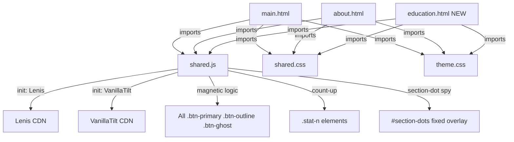

# v2/ Portfolio Upgrade — Full Architectural Plan
**14 Tasks | Files: main.html, about.html, education.html (new), shared.js, shared.css, theme.css**

---

## Architecture Overview



---

## External Libraries to Add (CDN only, no npm)

| Library | CDN URL | Used For |
|---|---|---|
| **Three.js r158** | `https://cdnjs.cloudflare.com/ajax/libs/three.js/r134/three.min.js` | Hero particle field |
| **Lenis 1.x** | `https://unpkg.com/@studio-freight/lenis@1.0.42/dist/lenis.min.js` | Smooth scroll |
| **VanillaTilt.js** | `https://cdnjs.cloudflare.com/ajax/libs/vanilla-tilt/1.8.1/vanilla-tilt.min.js` | Project card 3D tilt |

All three go in `<head>` **before** `shared.js` on pages that use them. GSAP + ScrollTrigger remain as-is.

---

## Task 1 — Hero Upgrade (`main.html`)

### 1a. Three.js Particle Field
- Add `<canvas id="hero-canvas">` inside `.hero-right` (behind the photo grid)
- Canvas is `position:absolute; inset:0; z-index:1` (photo-wrap is `z-index:2`)
- Three.js scene: `~800` `Points` particles — small white/copper dots forming a slow-rotating geometric lattice (icosahedron wireframe + random cloud)
- Camera slowly drifts on `mousemove` parallax (`lerp` to target)
- Colors: `var(--copper)` tinted particles against dark `var(--ink2)` background
- **Easy to disable:** remove `<canvas id="hero-canvas">` and the `initHeroCanvas()` call in `shared.js`

### 1b. Magnetic CTA Buttons
- Class `.mag-btn` added to all `.btn-primary` and `.btn-outline` elements
- JS: on `mousemove` within 80px of button, translate button toward cursor (`strength: 0.35`)
- On `mouseleave`, spring back to `transform: translate(0,0)` via CSS transition
- Implemented in `shared.js` `initMagneticButtons()`

### 1c. Depth Parallax Layers
- `.hero-left` gets `data-depth="0.2"` — moves at 20% of scroll speed
- `.photo-frame` gets `data-depth="0.5"` — moves at 50% (floats up faster)
- `.h-coord` gets `data-depth="0.1"` — very slow
- Pure JS `requestAnimationFrame` loop reading `window.scrollY`, no extra library

### 1d. Floating Section-Indicator Dots
- Fixed overlay `<div id="section-dots">` on right side
- One `<button class="sec-dot">` per section (hero, about, skills, projects, education, contact)
- Active dot glows with `var(--copper)` radial shadow
- Click scrolls to section via Lenis
- Spy logic in `shared.js` `initSectionDots()`
- **Easy to remove:** delete the `#section-dots` div and its CSS block

---

## Task 2 — Education Section (`main.html`)

Insert new `<section id="education">` **between** `#projects` and `#contact`.

### Structure
```
#education
  .vertical-label  // "// 005 — Formation"
  .education-inner
    .sec-num        // "05" (ghost)
    .sec-title      // "Academic<br><em>Formation</em>"
    .edu-timeline   // vertical centre-line timeline
      .edu-item[data-side="left"]   × N
      .edu-item[data-side="right"]  × N
```

### Timeline Items (pre-filled, easy to add/remove)
Each `.edu-item` has:
- `.ei-dot` — glowing circle on the centre line
- `.ei-date` — year badge
- `.ei-card` — contains title, institution, detail tags
- `data-side="left|right"` — alternates sides on desktop, all left on mobile

| Entry | Institution | Years | Notes |
|---|---|---|---|
| BSc Mechatronics & Control Engineering | UET Lahore | 2023 – Present | CGPA shown, key courses list |
| Intermediate (FSc Pre-Engineering) | Govt. College Gilgit | 2021 – 2023 | — |
| Matric (Science) | School, Gilgit | 2019 – 2021 | — |
| Self-Taught — Web Dev & UI/UX | Online | 2022 – Present | GSAP, Three.js, React, etc. |
| Self-Taught — Embedded Systems | Online | 2023 – Present | Bare-metal C, FreeRTOS |
| Certifications Explored | Various | 2024–Present | Modern Robotics (Northwestern), Generative AI (Microsoft), Cybersecurity, Financial Markets |

### Scroll Animation
- Each `.ei-card` has class `rv` — standard GSAP fade-up
- `.ei-dot` pulses via CSS `@keyframes pulse-dot` when in view (ScrollTrigger `onEnter`)
- Centre line draws itself: `height: 0` → `height: 100%` via ScrollTrigger scrub

---

## Task 3 — Achievements Strip (`main.html`)

Insert **before** `#education` (or after — configurable with a comment).

### 3a. Marquee Facts Strip
```html
<div class="achievements-marquee">
  <div class="am-track">
    <!-- Repeat 2× for seamless loop -->
    <span>4+ Engineering Disciplines</span>
    <span class="am-sep">◆</span>
    <span>UET Lahore — Mechatronics</span>
    ...
  </div>
</div>
```
- Pure CSS `@keyframes marquee-scroll` — `translateX(0)` → `translateX(-50%)`
- Speed: 30s infinite linear
- Pauses on hover (`animation-play-state: paused`)

### 3b. Achievement Cards Grid
```html
<div class="achievements-grid">
  <div class="ach-card rv">
    <div class="ach-icon">🏆</div>
    <div class="ach-num" data-count="4">0</div>
    <div class="ach-label">Engineering Disciplines</div>
  </div>
  ...
</div>
```
- Grid: `repeat(auto-fit, minmax(200px, 1fr))`
- `data-count` drives count-up animation from `shared.js`
- **Easy to add:** copy a `.ach-card` block

---

## Task 4 — Project Cards VanillaTilt + Spotlight (`main.html`)

### 4a. VanillaTilt
- Add `data-tilt data-tilt-max="8" data-tilt-speed="400" data-tilt-glare="true" data-tilt-max-glare="0.15"` to every `a.proj-card`
- `VanillaTilt.init(document.querySelectorAll('.proj-card'), {...})` in `shared.js initVanillaTilt()`
- Preserve existing hover colour-invert effect — tilt is purely transform layer

### 4b. Glowing Spotlight
- Each `.proj-card` gets a `<div class="pc-spotlight">` pseudo-overlay (`position:absolute; inset:0; pointer-events:none; opacity:0`)
- `background: radial-gradient(circle 120px at VAR_X VAR_Y, rgba(212,132,58,0.18), transparent)`
- `mousemove` on card → update `--mx` and `--my` CSS vars → opacity 1
- `mouseleave` → opacity 0

---

## Task 5 — Magnetic Buttons (`main.html` + `about.html`)

Already covered in Task 1b. Selector covers:
- `.btn-primary` — View Projects, etc.
- `.btn-outline` — Get in Touch
- `.btn-ghost` — any ghost buttons

`shared.js initMagneticButtons()` runs on **every page** that includes shared.js. Zero per-page changes needed.

---

## Task 6 — Lenis Smooth Scroll (`main.html` + `about.html`)

- Add Lenis CDN `<script>` in `<head>` of both pages (or add to shared.js conditional)
- `shared.js initLenis()`:
  ```js
  const lenis = new Lenis({ lerp: 0.08, smooth: true });
  gsap.ticker.add((time) => { lenis.raf(time * 1000); });
  gsap.ticker.lagSmoothing(0);
  ```
- Remove `html { scroll-behavior: smooth }` from pages using Lenis (conflict)
- Lenis `scrollTo()` used for section-dot clicks (Task 1d)

---

## Task 7 — `education.html` (New File)

### Layout: Sidebar + Main (matching stack-hardware.html pattern)
```
.project-nav (back to main.html | "FORMATION RECORD")
.page-hero (shared class)
  .ph-meta  "EDU_01 | Academic Timeline"
  .ph-title "Formation<br><em>Record</em>"
  .ph-desc
.edu-full-timeline (scrollable, full-width)
```

### Sections
1. **UET Lahore** — Mechatronics & Control Engineering (2023–Present)
   - CGPA display (animated count-up)
   - Key courses: Control Systems, Embedded Systems, Signal Processing, Engineering Math
   - Data panel: visual course-load hexagon or spider chart (CSS only)

2. **Intermediate FSc** — Govt. College Gilgit (2021–2023)

3. **Matric Science** — School, Gilgit (2019–2021)

4. **Self-Taught — Web Engineering** (2022–Present)
   - GSAP, Three.js, Vanilla JS, React, CSS Architecture
   - Timeline bar visual

5. **Self-Taught — Embedded / Hardware** (2023–Present)
   - Bare-metal C, FreeRTOS, BLDC FOC, KiCad

6. **Certifications Explored** (2024–Present)
   - Modern Robotics Specialization — Northwestern University (Robot Kinematics & Dynamics)
   - Microsoft Account Manager + Generative AI
   - Cybersecurity Fundamentals
   - Generative AI (various platforms)
   - Financial Markets & Investments

### Visual Style
- Dark background (`var(--bg-dark)`) like skills/contact
- Vertical timeline centre-line (SVG animated draw)
- Each entry: data panel with `.dp-head` + content
- Roadmap section at bottom: horizontal progress track showing "learning path" from Matric → UET → Advanced Certs

---

## Task 8 — `about.html` Upgrade

### 8a. 3D Rotating Skill Constellation (CSS 3D)
- Replace the bare `.stats-grid` side with a 3D sphere of skill nodes
- `<div class="skill-constellation">` with `.sc-orbit` rings using `transform-style: preserve-3d`
- Each ring has `rotateX(Xdeg)` — orbit 1: web skills, orbit 2: hardware skills, orbit 3: languages
- Auto-rotates via CSS `@keyframes orbit-spin 20s linear infinite`
- On hover: pauses and shows tooltip

### 8b. Parallax Bio Section
- `.about-left` text paragraphs: each `<p>` gets `data-depth="0.05 | 0.1 | 0.15"` for subtle parallax
- JS scroll handler lerps `translateY` on each element

### 8c. Count-Up Stat Counters
- `.stat-n` elements get `data-count="4"` attribute
- `shared.js initCountUp()` uses `IntersectionObserver` — when stat enters viewport, count from 0 to `data-count` over 1.2s with easing
- Non-numeric values (`∞`, `UET`) are skipped gracefully

---

## Task 9 — 3D Hexagonal Skill Grid (`main.html`)

Replace `.skills-cols` (3-column bars) with `.hex-grid`.

### HTML Structure
```html
<div class="hex-grid">
  <!-- Easy to add: copy a .hex-cell block -->
  <div class="hex-cell rv" style="--hue:30;">
    <div class="hex-inner">
      <div class="hex-icon">⚙</div>
      <div class="hex-name">SolidWorks</div>
      <div class="hex-level" data-w="88"></div>
    </div>
  </div>
  ...
</div>
```

### CSS 3D Technique
- Hexagon shape via `clip-path: polygon(50% 0%, 100% 25%, 100% 75%, 50% 100%, 0% 75%, 0% 25%)`
- `transform-style: preserve-3d` on `.hex-grid`
- Each `.hex-cell` has `transition: transform 0.4s` — on hover `rotateY(180deg)` flips to show skill level bar on back face
- Staggered entrance via GSAP `stagger` ScrollTrigger
- **Fallback:** if JS disabled, cells just show front face static

### Skill Groups (preserve existing 3 categories but re-skinned)
Keep same `href` links to stack pages via `.hex-group-header` above each cluster.

---

## Task 10 — Ambient Canvas Orbs (`main.html`)

Add `<canvas id="ambient-canvas">` as first child of `#skills` and `#contact`.

- `position: absolute; inset: 0; pointer-events: none; z-index: 0`
- All section content gets `position: relative; z-index: 1`
- Canvas draws 6–8 soft radial gradient "orbs" that drift slowly via `sin/cos` parametric paths
- Colors: `rgba(181,101,29,0.08)` copper + `rgba(26,58,110,0.12)` blue
- `shared.js initAmbientCanvas(canvasId)` — reusable function, call for each section
- **Easy to disable:** remove `<canvas>` tags, the function is safe to leave in shared.js

---

## Task 11 — Nav Upgrade (All Pages)

### Glowing Underline Scroll-Spy
In `shared.css`, `.nav-links a::after` already exists. Upgrade:
- Change from `height: 1px` to `height: 2px` with `box-shadow: 0 0 8px var(--accent)`
- JS in `shared.js initNavSpy()`:
  - Reads all `[id]` sections
  - On scroll, sets `data-active` on matching nav link
  - CSS: `a[data-active="true"]::after { width: 100%; box-shadow: 0 0 8px var(--accent); }`

### Education Link
Add to nav in all 3 pages:
- `main.html` nav: add `<li><a href="#education">Education</a></li>` (inline section link)
- `about.html` nav: add `<li><a href="education.html">Education</a></li>`
- `education.html` nav: active class on Education link

### Section Numbering update
After adding Education section to main.html, Contact becomes section 05 (was 04). Update `.vertical-label` and `.sec-num`.

---

## Task 12 — Contact Section Upgrade (`main.html`)

### 12a. 3D Tilt Terminal Card
- Add `data-tilt data-tilt-max="5"` to `.terminal-block`
- Add `box-shadow` that shifts on tilt via CSS vars updated by VanillaTilt glare

### 12b. Interactive Contact Form (HTML/CSS only)
Add below the terminal block:
```html
<!-- ══ CONTACT FORM — copy/paste new fields freely ══ -->
<form class="contact-form" id="contact-form" onsubmit="return false;">
  <div class="cf-field">
    <label class="cf-label">Your Name</label>
    <input type="text" class="cf-input" placeholder="John Doe" autocomplete="off">
  </div>
  <div class="cf-field">
    <label class="cf-label">Subject</label>
    <input type="text" class="cf-input" placeholder="Project Brief / Collab">
  </div>
  <div class="cf-field cf-field--full">
    <label class="cf-label">Message</label>
    <textarea class="cf-input cf-textarea" rows="5" placeholder="Describe the problem..."></textarea>
  </div>
  <button type="submit" class="btn-primary mag-btn cf-submit"><span>Transmit Message →</span></button>
</form>
```
- Brutalist style: no rounded corners, copper `border-bottom` focus state, monospace font
- `cf-input:focus` → `border-color: var(--copper2); box-shadow: 0 2px 0 var(--copper2)`
- No backend — form shows styled "success" message in terminal output area on submit

---

## Task 13 — Shared Footer (`about.html` + `education.html`)

Both pages currently have no footer or a minimal one. Add matching `<footer class="site-footer">` (identical to `main.html` style):

```html
<footer class="site-footer">
  <a href="main.html" class="foot-logo">IA<em>.</em></a>
  <div class="foot-links">
    <a href="about.html">About</a>
    <a href="education.html">Education</a>
    <a href="stack-hardware.html">Stack</a>
    <a href="main.html#projects">Projects</a>
    <a href="main.html#contact">Contact</a>
  </div>
  <div class="foot-copy">© <span class="yr"></span> ISHTIYAQ AHMAD. ALL RIGHTS RESERVED.</div>
</footer>
```
Already styled in `shared.css` `.site-footer`. Zero extra CSS needed.

---

## Task 14 — `shared.js` Upgrade

### New Function Map

```js
// ─── INIT ORDER ───────────────────────────────────────
// All called inside initAnimations() after loader resolves

initLenis()          // Task 6  — smooth scroll
initMagneticButtons() // Task 5  — magnetic CTAs
initVanillaTilt()    // Task 4  — project + terminal card tilt
initCountUp()        // Task 8c — stat counter animation
initSectionDots()    // Task 1d — fixed right-side nav dots
initNavSpy()         // Task 11 — scroll-spy glowing underline
initAmbientCanvas()  // Task 10 — ambient orbs on dark sections
initHeroCanvas()     // Task 1a — Three.js hero particle field (main only)
```

### `initLenis()`
```js
// ── LENIS SMOOTH SCROLL ─────────────────────────────────────────────────────
// Requires: Lenis CDN loaded before shared.js
// To disable: remove Lenis CDN and delete this function call
function initLenis() {
  if (typeof Lenis === 'undefined') return;
  const lenis = new Lenis({ lerp: 0.08 });
  window._lenis = lenis; // expose for section-dot scrollTo
  gsap.ticker.add((time) => { lenis.raf(time * 1000); });
  gsap.ticker.lagSmoothing(0);
  // Remove native scroll-behavior:smooth to avoid conflict
  document.documentElement.style.scrollBehavior = 'auto';
}
```

### `initMagneticButtons()`
```js
// ── MAGNETIC BUTTON EFFECT ──────────────────────────────────────────────────
// Selector: .mag-btn (add this class to any button/link you want magnetic)
// Strength: 0.35 — increase for stronger pull
// Range: 80px — how close cursor must be before magnet activates
function initMagneticButtons() { ... }
```

### `initVanillaTilt()`
```js
// ── VANILLA TILT 3D ─────────────────────────────────────────────────────────
// Applied to: .proj-card (projects grid) and .terminal-block (contact)
// To add tilt to new elements: add class "tilt-card" to the element
// To disable for a specific element: add data-tilt-disabled
function initVanillaTilt() {
  if (typeof VanillaTilt === 'undefined') return;
  VanillaTilt.init(document.querySelectorAll('.proj-card, .tilt-card'), {
    max: 8, speed: 400, glare: true, 'max-glare': 0.12
  });
}
```

### `initCountUp()`
```js
// ── ANIMATED COUNT-UP ───────────────────────────────────────────────────────
// Trigger: IntersectionObserver on elements with [data-count]
// Duration: 1400ms with easeOutExpo curve
// Non-numeric values (∞, UET) are skipped automatically
function initCountUp() { ... }
```

### `initSectionDots()`
```js
// ── SECTION INDICATOR DOTS ──────────────────────────────────────────────────
// Reads: all <section id="..."> elements
// Renders: fixed right-side dots in #section-dots div
// To add a new section to the dots: just give the section an id="" attribute
// To disable entirely: remove <div id="section-dots"> from HTML
function initSectionDots() { ... }
```

---

## File Change Summary

| File | Action | Key Changes |
|---|---|---|
| `v2/main.html` | **MODIFY** | Add CDN scripts, hero canvas, Three.js, section-dots div, education section, achievements section, hex-grid skills, tilt on proj-cards, contact form, ambient canvases, updated nav |
| `v2/about.html` | **MODIFY** | Add CDN scripts, skill constellation, parallax attrs, count-up attrs, updated nav, shared footer |
| `v2/education.html` | **CREATE** | Full new page — timeline layout |
| `v2/shared.js` | **MODIFY** | 8 new init functions appended |
| `v2/shared.css` | **MODIFY** | Education timeline styles, hex-grid styles, contact form styles, constellation styles, section-dots styles, nav glowing underline upgrade, achievements styles |
| `v2/theme.css` | **NO CHANGE** | Design tokens remain intact |

---

## Commenting Convention for Easy Section Management

Every new HTML section block follows this pattern:
```html
<!-- ══════════════════════════════════════════════════
     SECTION: [NAME] — [brief description]
     TO REMOVE: Delete from here ↓ to ↑ END [NAME]
     TO ADD NEW ITEM: Copy the .item block inside
     ══════════════════════════════════════════════════ -->
...content...
<!-- END [NAME] ══════════════════════════════════════ -->
```

Every JS init function has a `// To disable:` comment at the top.

---

## Implementation Order (recommended for Code mode)

1. `shared.css` — add all new CSS blocks first (hex-grid, timeline, constellation, dots, form, orb)
2. `shared.js` — append all 8 new init functions
3. `main.html` — apply all main page changes (largest file, most changes)
4. `about.html` — upgrade
5. `education.html` — create new file
6. Smoke-test all three pages
